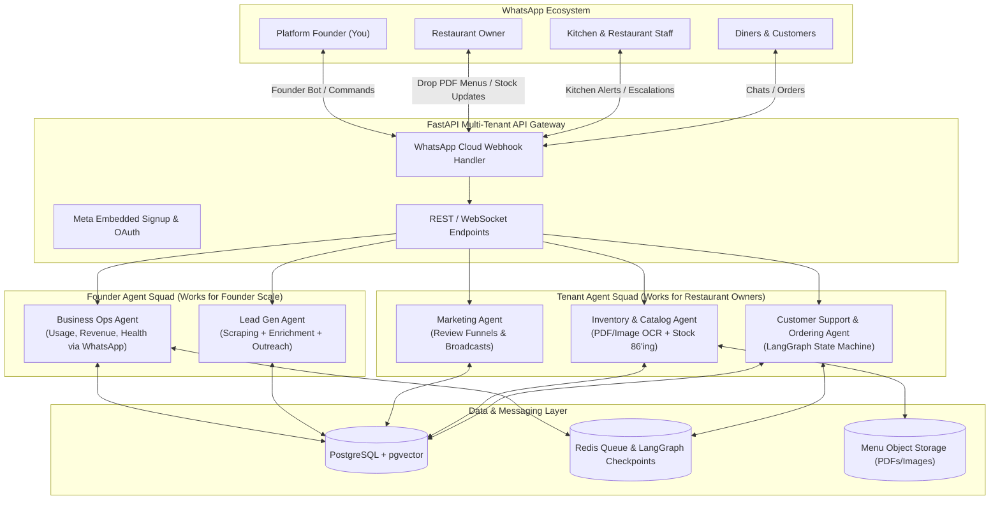
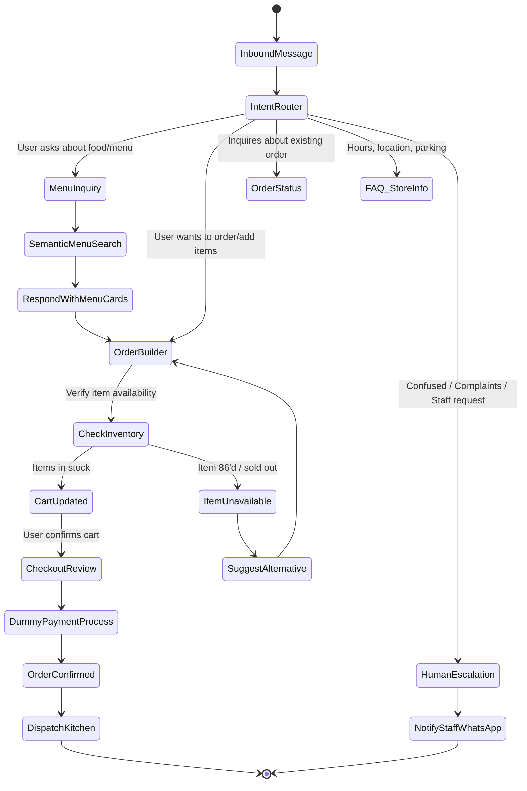
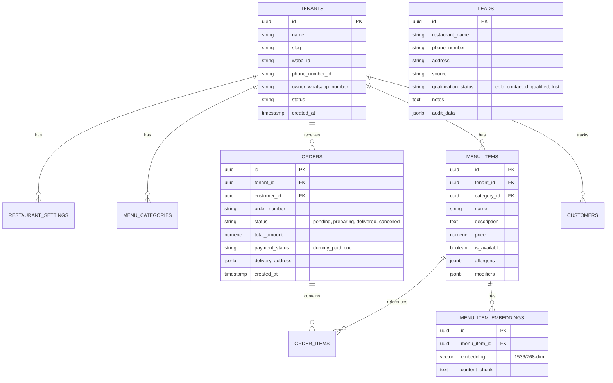

# Architectural Specification & Implementation Plan: Autonomous Restaurant Multi-Agent Platform

A multi-tenant, autonomous AI agent platform designed to run restaurant operations over WhatsApp (customer ordering, menu management, customer support, marketing) alongside an internal founder growth engine (automated lead generation and business ops via WhatsApp).

---

## 1. System Overview & Dual-Domain Agent Hierarchy

The platform operates across two distinct domains:



---

## 2. Core Agent Specifications

### 2.1. Tenant Domain (Restaurant Operations)

| Agent | Target User | Responsibilities | Key Tools / Triggers |
| :--- | :--- | :--- | :--- |
| **Customer Support & Ordering Agent** | Diners / WhatsApp Customers | Intent classification, conversational menu browsing, allergy/dietary filtering, conversational cart builder, dummy checkout/payment, order confirmation, FAQs. | `search_menu_pgvector`, `build_cart`, `calculate_subtotal`, `create_order`, `trigger_human_escalation`. |
| **Inventory & Catalog Agent** | Restaurant Owners | Ingests PDF / image menus sent directly to the Owner WhatsApp bot or web dashboard; updates prices, descriptions, and categories; processes real-time 86'd / out-of-stock commands (e.g. *"We are out of pepperoni"*). | `parse_menu_document_vision`, `update_item_availability`, `sync_menu_embeddings`, `alert_low_stock`. |
| **Marketing Agent** | Past Diners & Owners | Post-delivery review collection (sends WhatsApp follow-up 45-60m after order; routes happy diners to Google Maps review link); runs automated re-engagement broadcast campaigns for inactive customers (>14 days). | `get_completed_orders`, `send_feedback_template`, `generate_broadcast_segment`, `dispatch_promo_campaign`. |
| **Kitchen Dispatcher & Escalation** | Kitchen Staff | Broadcasts instant order tickets to staff WhatsApp group/number; pushes real-time WebSocket updates to the Live Kitchen Display System; alerts staff when human takeover is requested. | `notify_kitchen_whatsapp`, `push_kds_websocket`, `pause_bot_session`. |

### 2.2. Founder Domain (Platform Scale & Agency Engine)

| Agent | Target User | Responsibilities | Key Tools / Triggers |
| :--- | :--- | :--- | :--- |
| **Lead Generation Agent** | Founder (You) | Autonomously prospects local restaurants (Google Maps / Yelp / social media), checks if they lack automated WhatsApp ordering, enriches owner contacts, drafts/sends personalized cold outreach sequences, and qualifies replies. | `scrape_google_places`, `audit_restaurant_presence`, `send_cold_pitch_whatsapp`, `qualify_lead_response`. |
| **Business Operations Agent** | Founder (You) | Acts as your private WhatsApp executive assistant: tracks multi-tenant usage, active orders, token costs, restaurant health; delivers a daily digest; responds to founder commands (`/stats`, `/leads`, `/health`). | `get_platform_metrics`, `calculate_token_burn`, `list_hot_leads`, `send_founder_whatsapp_digest`. |

---

## 3. WhatsApp Integration & Multi-Tenancy Architecture

### 3.1. Onboarding: Meta Embedded Signup Flow
To ensure zero friction for restaurant owners:
1. **Frontend Integration**: Restaurant owner clicks **"Connect WhatsApp"** inside the Next.js portal.
2. **Meta Popup**: Meta Embedded Signup modal loads; owner logs into Facebook and selects or creates their WhatsApp Business Account (WABA).
3. **OAuth Handshake**: Frontend receives a temporary authorization code from the Meta SDK and posts it to the FastAPI backend.
4. **Backend Token Exchange**: FastAPI exchanges the code for a permanent System User Access Token, registers the `waba_id`, `phone_number_id`, and configures the webhook subscriptions.
5. **Webhook Routing**: All inbound webhooks hit a single Meta endpoint (`/api/v1/webhooks/whatsapp`). The payload's `entry[0].changes[0].value.metadata.phone_number_id` maps directly to the restaurant tenant ID in PostgreSQL.

### 3.2. WhatsApp Webhook & Message Pipeline
```
[Inbound WhatsApp Webhook]
       │
       ▼
[FastAPI Webhook Validator] ── (HMAC SHA256 Signature Verification)
       │
       ▼
[Redis Task Queue (ARQ / Celery)] ── (Asynchronous message de-duplication & ACK to Meta in <200ms)
       │
       ▼
[Tenant Message Router]
  ├── Customer Phone? ──> LangGraph Customer Support Agent
  ├── Owner Phone? ──> LangGraph Inventory Agent (PDF/Menu update mode)
  └── Founder Phone? ──> LangGraph BizOps Agent
```

---

## 4. LangGraph Agent Workflows

### 4.1. Customer Support & Ordering State Machine


---

## 5. Database Schema Architecture (PostgreSQL + pgvector)



---

## 6. Directory & Codebase Structure

```
autonomous-agents/
├── docker-compose.yml              # Local Postgres + pgvector + Redis
├── pyproject.toml / requirements.txt
├── .env.example
├── app/
│   ├── main.py                     # FastAPI application entrypoint
│   ├── config.py                   # Environment & settings validation
│   ├── api/
│   │   ├── v1/
│   │   │   ├── router.py
│   │   │   ├── webhooks_whatsapp.py# Inbound Meta WhatsApp webhook handler
│   │   │   ├── meta_auth.py        # Meta Embedded Signup & OAuth flow
│   │   │   ├── orders.py           # Order management & KDS endpoints
│   │   │   ├── menu.py             # Menu CRUD & PDF upload endpoint
│   │   │   └── leads.py            # Lead pipeline endpoints
│   ├── core/
│   │   ├── database.py             # Async SQLAlchemy session engine
│   │   ├── redis.py                # Redis connection & cache client
│   │   └── security.py             # Webhook signature validation & auth
│   ├── models/                     # SQLAlchemy ORM models
│   │   ├── tenant.py
│   │   ├── menu.py
│   │   ├── order.py
│   │   ├── customer.py
│   │   └── lead.py
│   ├── services/
│   │   ├── whatsapp_service.py     # Meta Cloud API message dispatcher (text, templates, interactive lists)
│   │   ├── menu_parser.py          # Vision LLM (Gemini Flash) PDF/image OCR parser
│   │   └── dummy_payment.py        # Dummy payment gateway interface
│   └── agents/
│       ├── state.py                # Base LangGraph Agent state schemas
│       ├── tenant/
│       │   ├── customer_support/   # LangGraph ordering & FAQ agent
│       │   │   ├── graph.py
│       │   │   ├── tools.py
│       │   │   └── prompts.py
│       │   ├── inventory/          # Catalog & stock 86'ing agent
│       │   │   ├── graph.py
│       │   │   └── tools.py
│       │   └── marketing/          # Review follow-up & broadcast agent
│       │       ├── graph.py
│       │       └── tools.py
│       └── founder/
│           ├── lead_gen/           # Google Maps scraper & cold pitch bot
│           │   ├── graph.py
│           │   └── tools.py
│           └── biz_ops/            # Founder WhatsApp assistant & monitoring
│               ├── graph.py
│               └── tools.py
```

---

## 7. Phased Implementation Roadmap

### Phase 1: Core Foundation & Customer Support + Inventory Agents
- [ ] Initialize Python environment, FastAPI application, and `docker-compose.yml` (Postgres with `pgvector` + Redis).
- [ ] Implement database models via SQLAlchemy with Alembic migrations.
- [ ] Build Meta WhatsApp Webhook handler with signature verification and async processing.
- [ ] Build **Customer Support & Ordering Agent** in LangGraph (menu retrieval with pgvector, cart state, dummy payment, order generation).
- [ ] Build **Inventory Agent** (menu PDF/image parsing with Vision LLM and WhatsApp stock update commands).

### Phase 2: Kitchen Dispatch & Marketing Automation
- [ ] Implement Kitchen Dispatch notification (instant WhatsApp order ticket to staff + WebSocket broadcast for live KDS).
- [ ] Implement Human-in-the-loop escalation pipeline (WhatsApp alert to staff + session pause/takeover).
- [ ] Build **Marketing Agent** (automated 1-hour post-delivery review follow-up + customer segmentation for WhatsApp broadcasts).

### Phase 3: Founder Growth Engine (Lead Gen & BizOps)
- [ ] Build **Lead Gen Agent** (prospecting local restaurants, assessing WhatsApp readiness, drafting outreach).
- [ ] Build **Business Ops Agent** (delivering metrics, revenue, token cost, and lead notifications directly to the founder's WhatsApp with interactive chat commands).

### Phase 4: Next.js Web Dashboard
- [ ] Meta Embedded Signup onboarding UI for restaurant owners.
- [ ] Live Kitchen Display System (KDS) with audio chimes.
- [ ] Menu & Inventory editor + PDF upload dropzone.
- [ ] Founder Admin Portal (lead pipeline, tenant health, analytics).

---

## 8. Verification & Testing Plan

### Automated Tests
- `pytest tests/unit`: Unit tests for cart calculations, dummy payments, and prompt template formatting.
- `pytest tests/integration`: Integration tests simulating Meta WhatsApp webhook payloads to verify tenant routing, LangGraph state transitions, and database state updates.

### Manual & Simulated Verification
- Test WhatsApp webhook simulation script (`tests/simulate_whatsapp_msg.py`) allowing instant local testing of customer conversations, order placement, and owner menu updates without needing a live Meta webhook tunnel during early development.
- ngrok / cloudflared tunnel verification with a live Meta WhatsApp test number.
